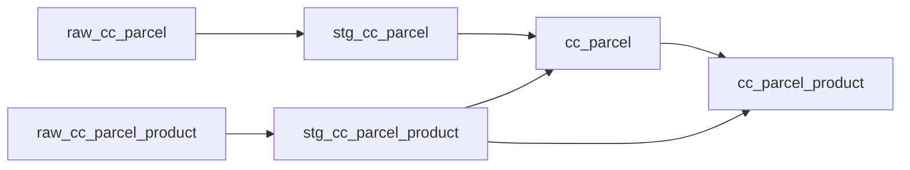

# Circle Parcel — dbt Project

A dbt project that turns raw parcel and shipment data into analytics-ready tables in BigQuery.

Built as part of the Workintech Data Analytics bootcamp, using dbt with a BigQuery adapter.

## What the project does

The source data comes from Circle, a company shipping physical parcels. Two raw tables land in BigQuery:

| Raw table | Grain |
|---|---|
| `raw_cc_parcel` | one row per parcel |
| `raw_cc_parcel_product` | one row per product inside a parcel |

The raw data is messy: column names have inconsistent casing (`DaTeCANcelled`, `Model_mAME`, `Date_sHIpping`) and all dates are stored as strings like `January 5, 2024`.

The project cleans this up in a staging layer, then builds two analytical models on top.

## Lineage



`cc_parcel_product` reads from both `cc_parcel` and `stg_cc_parcel_product`, so parcel-level attributes sit alongside the individual products.

## Models

### Staging

**`stg_cc_parcel`** — renames columns to consistent snake_case and parses all four date fields into real `DATE` columns.

**`stg_cc_parcel_product`** — renames columns for the product-level table.

Staging models are written to a separate `parcel_dbt_dev_staging` dataset so they stay out of the way of the reporting tables.

### Analytics

**`cc_parcel`** — one row per parcel. Adds:

- `status` — Cancelled / In progress / In transit / Delivered, derived from which date fields are populated
- `expedition_time`, `transport_time`, `delivery_time` — day counts between purchase, shipping and delivery
- `delay` — flag for deliveries taking more than 5 days
- `month_purchase` — for monthly aggregation
- `qty`, `nb_products` — product totals per parcel

**`cc_parcel_product`** — parcel-product level table, materialized as a BigQuery table partitioned on `date_purchase`.

Both are written to the `parcel_dbt_dev` dataset.

## Tests

Primary key tests (`not_null`, `unique`) are defined in two schema files: `stg_schema.yml` for the staging models and `schema.yml` for the analytics models.

Note that `stg_cc_parcel_product.parcel_id` intentionally has no `unique` test — that table's grain is parcel-product, so a parcel appears once per product it contains.

## Structure

```
models/
└── Circle_parcel/
    ├── schema.yml
    ├── cc_parcel.sql
    ├── cc_parcel_product.sql
    └── staging/
        ├── stg_schema.yml
        ├── stg_cc_parcel.sql
        └── stg_cc_parcel_product.sql
```

Target datasets are configured in `dbt_project.yml`:

- `models/Circle_parcel` → `parcel_dbt_dev`
- `models/Circle_parcel/staging` → `parcel_dbt_dev_staging`

## Running it

```bash
dbt run                        # build all models
dbt test                       # run tests only
dbt build                      # models + tests together
dbt run --select cc_parcel     # single model
```

Requires a `profiles.yml` pointing at a BigQuery project with the `raw_data_circle` dataset.

## Things I ran into

**Parse once, in staging.** My first version of `cc_parcel` called `PARSE_DATE` on every date column, then called it again inside every `DATE_DIFF`. Once staging handles the parsing, the analytics model reads much more clearly and the same conversion isn't repeated seven times.

**Aggregate before joining.** Joining `cc_parcel` straight to the product table multiplied every parcel row by its product count, which silently inflated the totals without throwing an error. Aggregating into a CTE first and joining to that keeps the grain at one row per parcel.

**BigQuery is case-insensitive about column names.** Aliasing `Date_purCHase AS date_purchase` while also selecting the raw column produces a duplicate column error, even though the two names look different.

**A failing test is information.** The `unique` test on `stg_cc_parcel_product.parcel_id` failed because that grain genuinely allows repeats. The test was wrong, not the data.

## Stack

dbt (Fusion) · BigQuery · Git